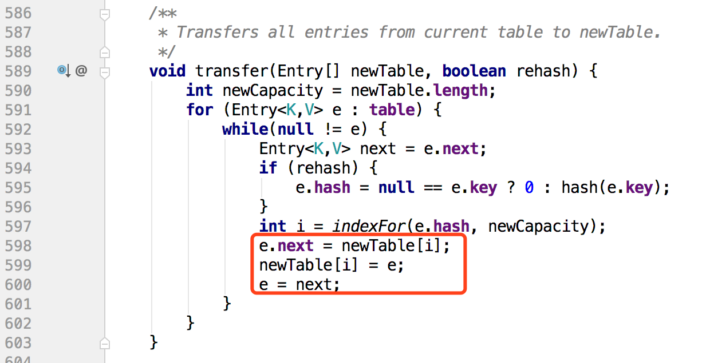

## HashMap
### jdk1.7版本
* 使用数组+链表结构存储数据
    > * 通过hash算法和数组索引算法，计算元素在数组中的索引位置
    > * 相同的hash值的元素使用链表存储，在实际存储前判断key是否已经存在的方式： key==entry.key || key.equals(entry.key)
    > * 扩容条件：实际使用的大小 >= 最大容量 * 负载因子
    
* 数组索引位置算法。
    > * hash = 0 ^ key.hashCode()，hash ^= (hash >>> 20) ^ (hash >>> 12) ^ (hash >>> 7) ^ (hash >>> 4) ，自定义hash算法，计算存储元素的hash值
    > * tableIndex = hash & (length - 1) , 和数组长度进行与运算，计算元素在数组中的位置。
    > * hashMap对null值单独做了处理，所有的null对象的数组索引位置为0

* 为什么散列算法不是直接length的余数？
    > 取余数的方式不能很好的让元素散列分布，在扩容时，链表的长度不会变化，随着put元素数量的增多
会导致链表不断加长。

* 为什么建议设置hashmap的大小为2^n ?
    > 数组最大长度参与hash值计算，即 length - 1。如果length -1为偶数，
则长度转换为2进制后，可能存在多个0，执行与运算时，相应位置二进制元素变为零，得出相同结果的概率增加，
即冲突的概率增加。如果length-1为奇数，则转换为二进制后，所有位置的值都是1，计算出的散列值不受影响。

* 为什么要重写对象的hashCode和equal方法？
    > * 保证实例对象的唯一性。需要存放到hashMap中对象都需要重写这两个方法。
    > * hashCode值相等，equal值不一定相等。equal值相等，hashCode值一定相等。

* jdk的object对象的默认hash的生成方式？
    > 将对象存储的内存地址转换为数字，数字类型为int，最大正值：2^31 - 1。所以，即使拥有相同值的对象，
他们的hashCode值也不同。

* get对象死循环出现场景？
    > * 场景：两个线程put元素，同时触发数组扩容
    > * [复现步骤参考](https://blog.csdn.net/xuefeng0707/article/details/40797085)
    > * 导致出现死循环的代码位置：直接将新元素放到数组顶部位置，如果原有位置已经存在元素，则在链表中指向已存在的元素。
